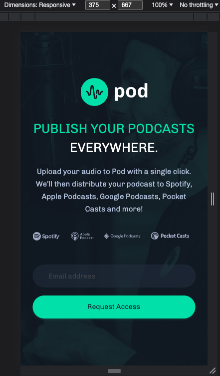

# Frontend Mentor - Pod request access landing page solution

This is a solution to the [Pod request access landing page challenge on Frontend Mentor](https://www.frontendmentor.io/challenges/pod-request-access-landing-page-eyTmdkLSG). Frontend Mentor challenges help you improve your coding skills by building realistic projects.

## Table of contents

- [Overview](#overview)
  - [The challenge](#the-challenge)
  - [Screenshot](#screenshot)
  - [Links](#links)
- [My process](#my-process)
  - [Built with](#built-with)
  - [What I learned](#what-i-learned)
- [Author](#author)

## Overview

A landing webpage who provdes a form which allows users to register with their email in order to publish a podcast. The project includes Desktop, Tablet and Mobile versions.

### The challenge

Users should be able to:

- View the optimal layout depending on their device's screen size
- See hover states for interactive elements
- Receive an error message when the form is submitted if:
  - The `Email address` field is empty should show "Oops! Please add your email"
  - The email is not formatted correctly should show "Oops! Please check your email"

### Screenshot

Desktop Version

Tablet Version

Mobile Version

### Links

- Solution URL: [Solution URL here](https://github.com/AlinaAlexandraVizireanu/pod-request-access-landing-page)
- Live Site URL: [Live site URL here](https://alinaalexandravizireanu.github.io/pod-request-access-landing-page/)

## My process

I've built this project using a Figma design file. In the first part of the project I've built the HTML code and in the second part I designed the Desktop, Tablet and Mobile versions with CSS. In the last part of the project I've implemented with JavaScript the form functionality to display an error message if the information inside is not valid.

### Built with

- Semantic HTML5 markup
- CSS custom properties
- Flexbox

### What I learned

In the process of building the project I've learned how to design the webpage with CSS with the help of a figma file and how to optimise the design based on multiple screen sizes.

## Author

- Website - [Alina Alexandra Vizireanu](https://alinaalexandravizireanu.github.io/pod-request-access-landing-page/)
- Frontend Mentor - [@AlinaAlexandraVizireanu](https://www.frontendmentor.io/profile/AlinaAlexandraVizireanu)
